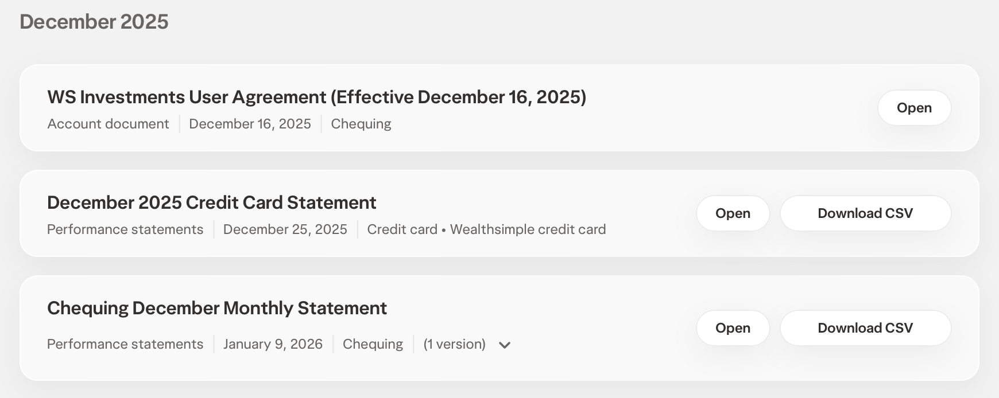

# Wealthsimple Chequing Account CSV (v1)

## Best for

Wealthsimple Cash (chequing/savings) account transaction exports with these columns:

- `date`
- `transaction`
- `description`
- `amount`
- `balance`
- `currency`

## How to export

1. Log into [Wealthsimple](https://my.wealthsimple.com)
2. Click your profile icon and select **Documents** from the dropdown

   

3. Find your Chequing Monthly Statement and click **Download CSV**

   

## Notes

- Amounts are already signed correctly: negative = debit/expense, positive = credit/income.
- The `transaction` column contains short type codes (e.g. `AFT_IN`, `OBP_OUT`, `E_TRFIN`, `INT`) — category rules can use `description` for classification.
- `balance` is ignored during import.
