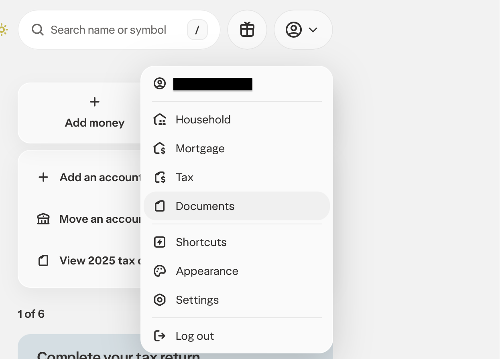

# Wealthsimple Credit Card Statement CSV (v2)

## Best for

Official Wealthsimple credit card statement exports with these columns:

- `transaction_date`
- `post_date`
- `type`
- `details`
- `amount`
- `currency`

## How to export

1. Log into [Wealthsimple](https://my.wealthsimple.com)
2. Click your profile icon and select **Documents** from the dropdown

   

3. Find your Credit Card Statement and click **Download CSV**

   

## Notes

- `transaction_date` is used as the import date.
- Amounts are already signed correctly for SpendSeer imports: purchases are positive and refunds are negative.
- No category column is mapped; use category rules to categorize.
- `Payment` rows may appear and can be removed before import or skipped with skip rules if you do not want card payments included.
